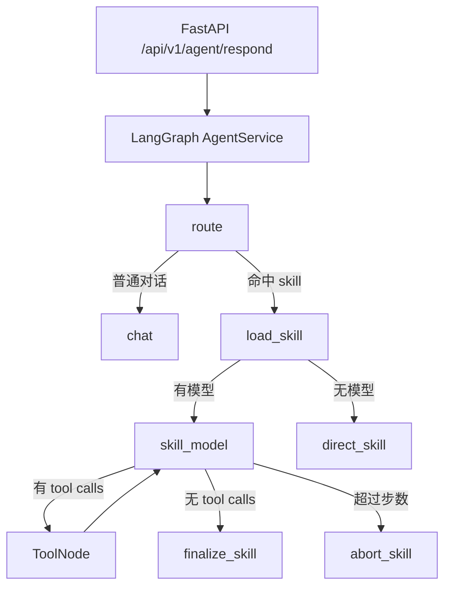

# Loom Agent

这是一个基于 `LangGraph + LangChain` 的单 Agent 服务，对外提供以下能力：

- 通过 `FastAPI` 提供统一接口
- 接收 `chat_id`、`message_id`、`user_input`、`chat_history`
- 兼容 `.agents/skills/<skill>/SKILL.md` 形式的 Agent Skills 目录标准
- 先判断是否命中 skill，未命中则正常对话，命中则执行 skill
- 使用 LangChain `@tool` 暴露 `read_file` 与 `execute_script`
- 根路径 `/` 提供一个最小前端，用于联调 `/healthz` 和 `/api/v1/agent/respond`

## 当前架构

本项目现在采用：

- `FastAPI` 作为服务入口
- `LangGraph StateGraph` 作为编排引擎
- `LangChain ChatOpenAI` 作为模型适配层
- `ToolNode` 执行 `read_file / execute_script`
- `SkillRegistry` 实现 skill 渐进式披露

## 图执行流程



## Skill 渐进式披露

路由阶段只加载 skill 摘要：

- `name`
- `description`
- `compatibility`
- `metadata`

只有在命中某个 skill 之后，才继续加载：

- 完整 `SKILL.md`
- `references/` 资源列表
- `scripts/` 资源列表

模型不会在一开始读完所有 skill 资源，而是需要时再调用 `read_file`。

## 工具声明

工具使用 LangChain `@tool` 装饰器声明，并由 `LangGraph ToolNode` 执行：

- `read_file`
- `execute_script`

工具内部仍然保留：

- 工作区路径约束
- 脚本后缀白名单
- 超时控制
- JSON 输出解析

## 启动方式

```powershell
pip install -r requirements.txt
uvicorn app.main:app --host 0.0.0.0 --port 8000 --reload
```

启动后可直接访问：

- `http://127.0.0.1:8000/`：最小前端
- `http://127.0.0.1:8000/healthz`：健康检查
- `http://127.0.0.1:8000/docs`：OpenAPI 文档

## 接口示例

### 请求

```json
{
  "chat_id": "chat-001",
  "message_id": "msg-1001",
  "user_input": "请帮我查看机器人现在电量多少",
  "chat_history": [
    {
      "role": "user",
      "content": "你好"
    },
    {
      "role": "assistant",
      "content": "你好，请问有什么可以帮你？"
    }
  ]
}
```

### 响应

```json
{
  "chat_id": "chat-001",
  "message_id": "msg-1001",
  "trace_id": "f6fb8c2f4d4d4c6e9c39c5bd0b5cba2b",
  "mode": "skill",
  "matched_skill": "robot-kitchen-navigation",
  "skill_reason": "用户明确要求让机器人去厨房",
  "reply_text": "已向机器人控制接口发送去厨房的导航请求。",
  "tool_traces": [
    {
      "tool_name": "execute_script",
      "arguments": {
        "path": "scripts/post_kitchen_navigation.py"
      },
      "success": true,
      "result_preview": "{...}"
    }
  ],
  "duration_ms": 742
}
```
